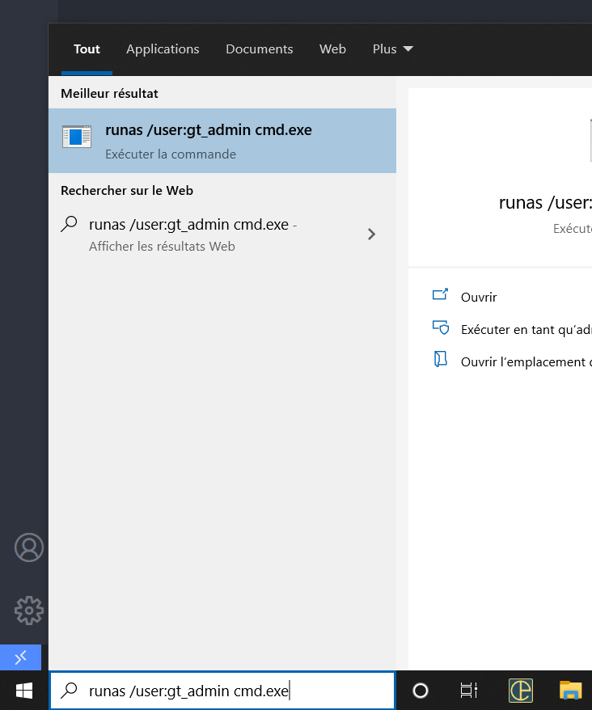

## Récupération dump LGO2

Sur le serveur LGO2, entrer 
``` 
runas /user:gt_admin cmd.exe 
```
 dans la ligne de commande de Windows.

Le mot de passe est **Adm1nGiph@rLGO2**



Une fois dans le terminal, entrer la commande suivante : 
```
pg_dump -D esculapedb -w > dumpall.sql

```

Cela va générer le dump complet de la DB _**LGO2**_

il ne reste plus qu'à la copier sur un support USB, en prenant soin de la compresser avant (Zip, Winrar, 7zip ....)


## Resauration du dump sur le poste de reprise

Copier le dump (_décomrpessé_) dans le répertoire du projet.

En ligne de commande (**dans le répertoire du projet**), entrer :
```
C:\opt\pgsql\bin\createdb.exe -U postgres -w -E UTF-8 -T template0 %%nomduprojet%%
C:\opt\pgsql\bin\psql.exe -U postgres -w -d %%nomduprojet%% -f "dumpall.sql"
```

où : 
 **%%nomduprojet%%** est le nom de la db utilisée pour restaurer.  Il **_DOIT_** être remplacé par le nom **réel** de votre projet.


pg_dump -d esculapedb -w -U esculape > dumpall.sql


changer md5 en trust

net stop postgresql
net start postgresql

